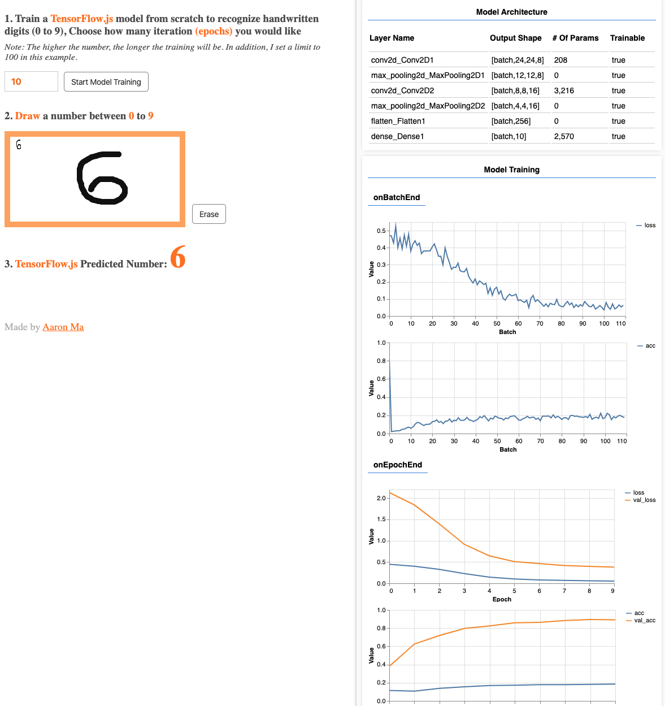

# ngConf 2020

This GitHub repository holds slides + code for Aaron Ma's ng-Conf 2020 talk on **A Journey into the World of Machine Learning with TensorFlow.js**.

- Slides: [Click here to access Google Slides](https://bit.ly/ngConf20)
- Live Demo: [Click here to access demo](http://aaronma.me/ngconf-2020/)

## Objective

Our goal is to train a TensorFlow.js model that will take hand written digit images and learn
to predict a score for each of the possible 10 classes (the digits 0-9), return the highest
possible score as index to look up the value inside `trueLabels` array.



## Getting Started

1. Clone the repository.

```bash
$ git clone https://github.com/aaronhma/ngconf-2020.git
```

2. Get inside the repository.

```bash
$ cd ngconf-2020
```

3. Start the development server.

```bash
$ yarn start
```

4. Open your favorite browser

```bash
$ open http://localhost:4200
```

--OR--

[Click here to access Angular localhost server](http://localhost:4200)
